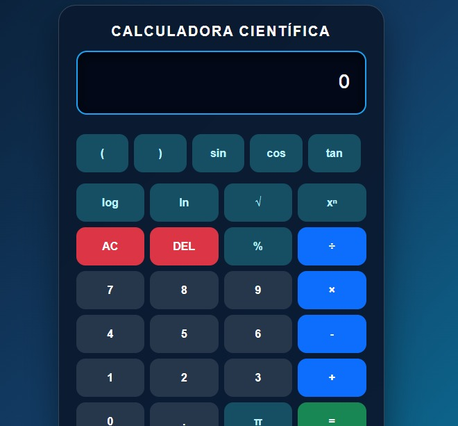

# Calculadora Científica - Grupo 1

## Objetivo de la Calculadora
El objetivo principal de este proyecto es desarrollar una calculadora científica web funcional y estéticamente agradable. La calculadora permite a los usuarios realizar operaciones aritméticas básicas así como cálculos científicos más complejos, ofreciendo una interfaz intuitiva, moderna y responsiva que se adapta a diferentes tamaños de pantalla.

## Tecnologías Utilizadas
- **HTML5:** Para la estructura semántica de la aplicación.
- **CSS3:** Para estilos personalizados, animaciones suaves y diseño visual (modo oscuro).
- **Bootstrap 5.3.3:** Framework CSS utilizado para el sistema de cuadrículas (grid), garantizando un diseño responsivo y adaptativo.
- **JavaScript (Vanilla):** Para la lógica de las operaciones matemáticas y la interactividad de la interfaz (manejo del DOM).

## Explicación de Funcionalidades Implementadas
La calculadora incluye las siguientes características:
1. **Operaciones Básicas:** Suma (+), resta (-), multiplicación (×) y división (÷).
2. **Funciones Científicas:**
   - Seno (`sin`), Coseno (`cos`) y Tangente (`tan`).
   - Logaritmo base 10 (`log`) y Logaritmo natural (`ln`).
   - Raíz cuadrada (`√`) y Potenciación (`xⁿ`).
3. **Utilidades Especiales:**
   - Cálculo de porcentajes (`%`).
   - Uso de la constante Pi (`π`).
   - Uso de paréntesis `()` para agrupar operaciones.
4. **Gestión de Pantalla:**
   - Botón **AC (All Clear):** Limpia completamente la pantalla.
   - Botón **DEL (Delete):** Borra el último carácter ingresado.
5. **Diseño Responsivo:** Interfaz diseñada con Bootstrap que se adapta a dispositivos móviles y de escritorio.

## Capturas de Pantalla

## Integrantes del Grupo
- Darwin Cabezas
- Mady Colobon
- Anny Liseth

## Conclusiones y Dificultades Encontradas
**Conclusiones:**
- El uso de frameworks como Bootstrap acelera significativamente el proceso de maquetación y diseño responsivo.
- La separación de responsabilidades (estructura en HTML, diseño en CSS y lógica en JavaScript) es fundamental para mantener el código ordenado y escalable.
- El diseño basado en colores oscuros (Dark Mode) mejora la experiencia de usuario y reduce la fatiga visual.

**Dificultades Encontradas:**
- **Lógica Matemática:** Manejar correctamente el orden de precedencia de las operaciones (uso de paréntesis y funciones científicas) puede ser un desafío en la implementación de la lógica en JavaScript.
- **Diseño del Grid:** Ajustar correctamente los botones dentro del sistema de columnas de Bootstrap para que mantuvieran una proporción adecuada en pantallas muy pequeñas requirió ajustes personalizados de CSS.
- **Manejo de Errores:** Prevenir que el usuario ingrese combinaciones inválidas (por ejemplo, múltiples puntos decimales seguidos o dividir por cero) exigió validaciones adicionales en el código.